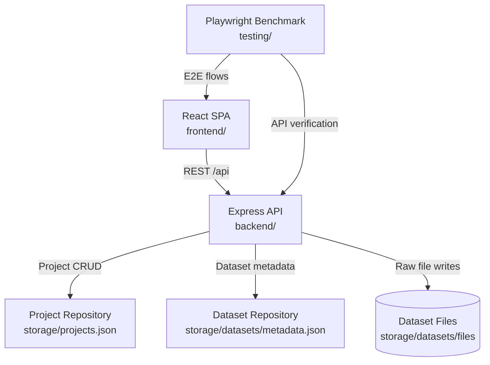

# Architecture

## 1. Document Purpose

This document provides an engineering-level view of the AI-Augmented AutoML Toolchain. It explains the runtime topology, major components, data flows, and the source layout required to extend or operate the platform confidently.

## 2. System Overview

### 2.1 Solution Summary

- **Frontend (`frontend/`)** – Vite + React SPA responsible for the AutoML user experience: project orchestration, dataset/document upload, query execution UI, and answer presentation.
- **Backend (`backend/`)** – Express + TypeScript API exposing REST endpoints for project CRUD, dataset profiling, Postgres-backed SQL services, document retrieval, and answer composition.
- **Benchmarking & Evaluation (`testing/`)** – Playwright suite for regression tests plus a TypeScript eval runner that validates NL→SQL and RAG endpoints against fixtures.

All workspaces live in a single monorepo. Shared tooling commands are defined at the repository root and delegate to workspace-specific scripts via `npm --prefix`.

### 2.2 High-Level Interaction Diagram

### 2.3 Runtime Topology

- API defaults to `http://localhost:4000/api` and can be hosted independently of the SPA.
- Frontend dev server runs at `http://localhost:5173` and proxies API calls to the backend.
- Postgres typically runs via Docker on host port `5433`; the backend connects using `DATABASE_URL`.
- Playwright benchmark spins up the compiled backend, serves the production frontend preview, and uses headless Chromium.

## 3. Component Architecture

### 3.1 Frontend SPA

- **Tech stack**: React 19, TypeScript, Vite, Tailwind CSS, shadcn/ui, Zustand.
- **Entry point**: `frontend/src/main.tsx` renders `<App />`.
- **Routing**: `frontend/src/App.tsx` defines routes for home, project redirect, and phase-specific workspace views.
- **Layout**: `frontend/src/components/layout/AppShell.tsx` provides the persistent shell with sidebar, breadcrumbs, theme toggle, and phase navigation.
- **State orchestration**:
  - `frontend/src/stores/projectStore.ts` persists project metadata locally, synchronizes with backend endpoints, and manages workflow phase state.
  - `frontend/src/stores/dataStore.ts` tracks uploaded files, dataset previews, query artifacts, and active tabs.
- **API integration**: `frontend/src/lib/api/` encapsulates all REST calls, wrapping `fetch` with consistent error handling and base URL resolution.

### 3.2 Backend API

- **Entry point**: `backend/src/index.ts` boots the HTTP server using `createApp()`.
- **Application assembly**: `backend/src/app.ts` configures CORS, logging, JSON parsing, and mounts feature routers under `/api`.
- **Routes**:
  - `backend/src/routes/projects.ts` – CRUD + metadata sync for AutoML projects.
  - `backend/src/routes/datasets.ts` – Dataset upload, profiling, and listing.
  - `backend/src/routes/documents.ts` – Context document ingestion (`/upload/doc`) and retrieval (`/docs/search`).
  - `backend/src/routes/answer.ts` – `/api/answer` endpoint composing responses with citations and cache metadata.
  - `backend/src/routes/health.ts` – Liveness diagnostics (`/api/health`).
  - `backend/src/routes/query.ts` – NL→SQL, direct SQL, and cache config endpoints.
  - `backend/src/routes/preprocessing.ts` – Preprocessing analysis + suggestion endpoints.
  - `backend/src/routes/featureEngineering.ts` – Applies feature specs and writes derived datasets.
  - `backend/src/routes/execution.ts` – Python execution sessions, package installs, and runtime health.
- **Persistence & services**:
  - `backend/src/repositories/projectRepository.ts` – File-backed project store with schema sanitization and in-memory fallback.
  - `backend/src/repositories/datasetRepository.ts` – File-backed dataset metadata store with UUID identities.
  - `backend/src/services/datasetProfiler.ts` – CSV/JSON/XLSX parsing, column inference, and sampling logic leveraged during uploads.
  - `backend/src/services/documentParser.ts`, `textChunker.ts`, `embeddingService.ts` – Pipeline for parsing PDFs/Markdown, chunking with overlap, and generating lightweight embeddings for retrieval.
  - `backend/src/services/documentIngestion.ts`, `documentSearchService.ts` – Persist documents/chunks/embeddings to Postgres and run cosine + keyword reranking for `/api/docs/search`.
  - `backend/src/services/sqlExecutor.ts`, `queryCache.ts`, `nlToSql.ts` – Sprint 3 query execution stack (read-only enforcement, caching, NL→SQL stubs, EDA summaries).
  - `backend/src/services/answerService.ts` – Retrieves top chunks, composes simple answers with citation metadata, and caches responses in-memory for `/api/answer`.
  - `backend/src/services/executionService.ts`, `containerManager.ts` – Docker-backed Python execution and package management.
  - `backend/src/services/featureEngineering.ts` – Applies feature specs to datasets via the runtime container.
- **Configuration**: `backend/src/config.ts` consolidates environment variables (port, CORS origins, storage paths). Defaults assume local single-node development.

### 3.3 Automation & Quality Gates

- `testing/` workspace contains:
  - `playwright.config.ts` – Launch parameters for the benchmark run.
  - `tests/benchmark.spec.ts` – Canonical end-to-end scenario covering project creation and dataset ingestion.
  - `tests/evalRunner.ts` – NL→SQL + RAG evaluation harness backed by fixtures (`testing/fixtures/*.json`). Run with `EVAL_API_BASE=http://localhost:4000/api npm --prefix testing run eval`.
  - `helpers.ts` and `fixtures/` – Shared utilities and sample data files.
- Repository root scripts orchestrate builds and tests:
  - `npm run benchmark` / `npm run benchmark:headed` – Build both workspaces and execute Playwright runs.
  - `npm run eval` – Convenience alias for the evaluation suite.
  - CI (`.github/workflows/ci.yml`) spins up Postgres, runs migrations, seeds a project, starts the backend, and executes the eval runner on every push/PR.

## 4. Data & Configuration

### 4.1 Persistence Targets

| Path | Data | Retention Strategy |
| ---- | ---- | ------------------ |
| `storage/projects.json` | Project definitions and workflow state. | Managed via repository APIs with automatic directory creation. |
| `storage/datasets/metadata.json` | Dataset profiles (schema, sample, stats). | Updated per upload and on dataset mutations. |
| `storage/datasets/files/<datasetId>/<filename>` | Raw uploaded dataset binaries. | Stored exactly as received for future processing. |

Paths are relative to the backend workspace and may be overridden using environment variables. Postgres holds operational data for Sprint 3/4 features; use `DATABASE_URL` + `npm --prefix backend run db:migrate` to keep the schema current.

### 4.2 Postgres Schema (Sprint 3+)

Upcoming query, caching, and retrieval features persist operational data in Postgres. The initial migration (`backend/migrations/001_init.sql`) provisions:

- `projects`, `datasets`, `documents`, `chunks`, `embeddings` – relational mirrors of the JSON stores plus document chunk metadata used for RAG.
- `query_results` – audit log of executed SQL (text, latency, preview payloads).
- `query_cache` – normalized SQL hash per project, cached preview/result metadata, TTL timestamps for eviction.

`npm --prefix backend run db:migrate` executes these migrations once `DATABASE_URL` is configured.

### 4.2 Environment Variables

| Variable | Default | Purpose |
| -------- | ------- | ------- |
| `PORT` | `4000` | Backend HTTP port. |
| `ALLOWED_ORIGINS` | `http://localhost:5173` | CORS allowlist. |
| `STORAGE_PATH` | `storage/projects.json` | Project persistence location. |
| `DATASET_METADATA_PATH` | `storage/datasets/metadata.json` | Dataset profile store. |
| `DATASET_STORAGE_DIR` | `storage/datasets/files` | Directory to persist uploaded binaries. |
| `DOCUMENT_STORAGE_DIR` | `storage/documents/files` | Directory to persist uploaded context documents. |
| `DATABASE_URL` | _unset_ | Optional Postgres connection string for query/RAG services. |
| `PGSSLMODE` | `disable` | Controls TLS requirements when connecting to managed Postgres. |
| `PG_POOL_MIN`/`PG_POOL_MAX` | `0` / `10` | Pool sizing hints for the `pg` client. |
| `SQL_STATEMENT_TIMEOUT_MS`, `SQL_MAX_ROWS`, `SQL_DEFAULT_LIMIT` | `5000`, `1000`, `200` | Query execution guardrails. |
| `QUERY_CACHE_TTL_MS`, `QUERY_CACHE_MAX_ENTRIES` | `300000`, `500` | Cache configuration for NL→SQL/SQL endpoints. |
| `DOC_CHUNK_SIZE`, `DOC_CHUNK_OVERLAP` | `500`, `50` | Window/overlap used when chunking uploaded documents. |
| `DOCKER_ENABLED`, `DOCKER_IMAGE` | `true`, `automl-python-runtime` | Docker runtime toggle + image name for code execution. |
| `EXECUTION_NETWORK` | `bridge` | Docker network policy for runtime containers. |
| `EXECUTION_AUTO_BUILD_IMAGE` | `true` | Auto-build the runtime image when missing. |
| `EXECUTION_TIMEOUT_MS` | `30000` | Max per-cell execution time in ms. |
| `EXECUTION_MAX_MEMORY_MB` | `2048` | Memory cap for runtime containers. |
| `EXECUTION_MAX_CPU_PERCENT` | `100` | CPU cap for runtime containers. |
| `EXECUTION_WORKSPACE_DIR` | `storage/runtime` | Host path for runtime workspaces. |

Configuration is loaded once at process start (see `backend/src/config.ts`); copy `backend/.env.example` to `.env` to customize.

## 5. Core Data Flows

### 5.1 Project Lifecycle

1. React app initializes `projectStore`, which calls `GET /api/projects`.
2. Creating a project triggers `POST /api/projects` with normalized metadata.
3. Project updates (phase progression, metadata edits) use `PATCH /api/projects/:id`.
4. Deletion uses `DELETE /api/projects/:id`, which purges the record from the file store.

### 5.2 Dataset Upload & Profiling

1. Upload flow posts a `multipart/form-data` request to `/api/upload/dataset` with the file and optional `projectId`.
2. Backend detects file type, parses the payload via `datasetProfiler`, and builds a profile containing row counts, sampled rows, and column metadata.
3. Profile is persisted to `datasetRepository`; raw file is written to the dataset storage directory.
4. Response payload returns the normalized dataset profile, and the frontend stores it inside `dataStore` for display in the data viewer.

### 5.3 Document Ingestion & Retrieval

1. Context uploads (`POST /api/upload/doc`) send PDFs/Markdown/TXT with optional `projectId`.
2. Backend persists the binary under `DOCUMENT_STORAGE_DIR/<documentId>/`, extracts text (PDF parsing when applicable), chunks it using `DOC_CHUNK_SIZE`/`DOC_CHUNK_OVERLAP`, and writes chunk metadata + embeddings to Postgres (`documents`, `chunks`, `embeddings` tables).
3. Retrieval requests (`GET /api/docs/search?q=...&projectId=...&k=...`) compute a lightweight embedding for the query, score stored chunks via cosine similarity, apply a keyword-based reranker, and return the top-k chunks with scores, span offsets, and snippets so the frontend can render “Docs cited” panels or feed downstream answer generation.

### 5.4 Answer Composition

1. Frontend calls `POST /api/answer` with `{ projectId?, question, topK? }`.
2. Backend reuses the retrieval pipeline to fetch top chunks, composes a concise answer by stitching leading snippets, attaches citation metadata (`chunkId`, `documentId`, span offsets), and returns the payload along with latency/cache diagnostics.
3. Responses are cached in-memory for `ANSWER_CACHE_TTL_MS` to keep repeated questions fast and to expose cache-hit metrics to the UI/evaluation suite.

## 6. Development Workflow

1. **Install dependencies** – `npm --prefix backend install`, `npm --prefix frontend install`, and `npm --prefix testing install`.
2. **Configure Postgres** – Start a local instance (Docker `postgres:16` recommended) and set `DATABASE_URL`.
3. **Apply migrations** – `npm --prefix backend run db:migrate` (safe to re-run).
4. **Run locally** – `npm --prefix frontend run dev` or `npm --prefix backend run dev` to boot the stack in watch mode.
5. **Validate changes** – `npm run benchmark` / `npm run benchmark:headed` for E2E flows, and `npm run eval` (with `EVAL_API_BASE`) for NL→SQL + RAG metrics.
6. **Update infrastructure/docs** – Adjust `.env`, storage paths, Postgres credentials, and documentation as features evolve.

## Appendix A – Repository Reference

| Location | Description |
| -------- | ----------- |
| `backend/src/index.ts` | Backend entry point responsible for starting the HTTP server. |
| `backend/src/app.ts` | Central Express app composition (middleware, routing, error handling). |
| `backend/src/routes/*` | REST endpoints grouped by feature area (projects, datasets, health). |
| `backend/src/repositories/*` | Persistence layer abstractions for projects and datasets. |
| `frontend/src/main.tsx` | Vite bootstrap that renders the React application. |
| `frontend/src/App.tsx` | Top-level router and phase-aware workspace logic. |
| `frontend/src/components/**` | Reusable UI components, layout primitives, and feature modules. |
| `frontend/src/stores/**` | Zustand stores managing client-side application state. |
| `frontend/src/lib/api/**` | Typed fetch helpers that encapsulate backend communication. |
| `testing/tests/benchmark.spec.ts` | Canonical end-to-end benchmark executed by CI/local scripts. |

All paths are relative to the repository root unless otherwise noted.
