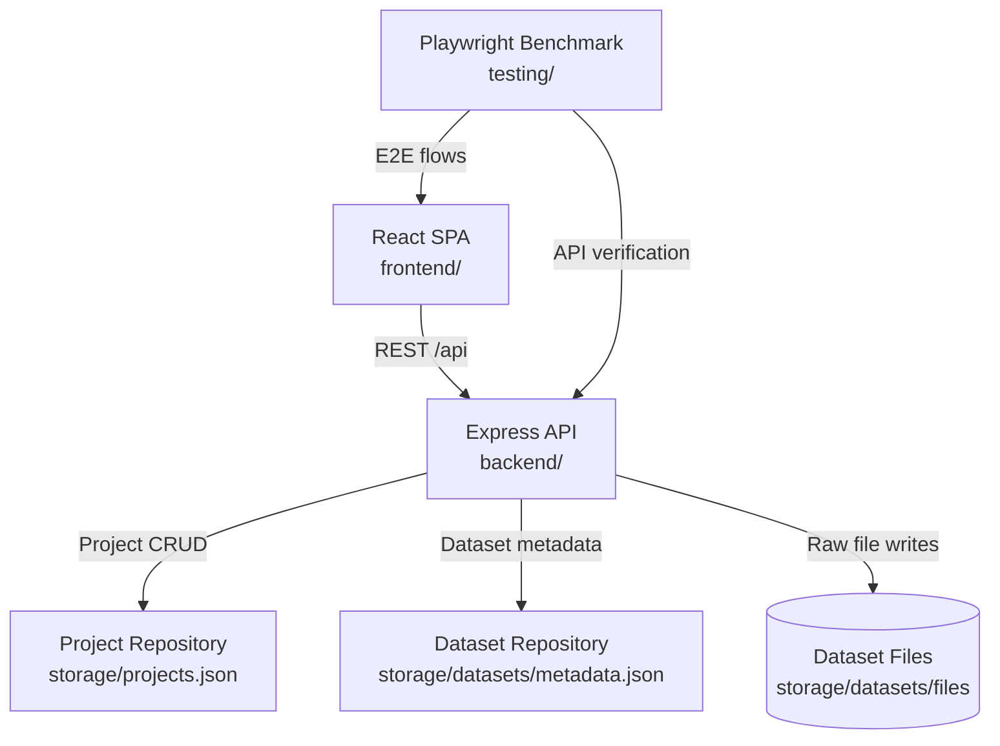

# Architecture

## 1. Document Purpose

This document provides an engineering-level view of the AI-Augmented AutoML Toolchain. It explains the runtime topology, major components, data flows, and the source layout required to extend or operate the platform confidently.

## 2. System Overview

### 2.1 Solution Summary

- **Frontend (`frontend/`)** – Vite + React SPA responsible for the AutoML user experience, including project orchestration, dataset upload, and data exploration.
- **Backend (`backend/`)** – Express + TypeScript API that exposes REST endpoints for project management, dataset ingestion, profiling, and storage.
- **Benchmarking (`testing/`)** – Playwright suite that exercises the compiled stack, ensuring critical flows (project creation, dataset upload) remain functional.

All workspaces live in a single monorepo. Shared tooling commands are defined at the repository root and delegate to workspace-specific scripts via `npm --prefix`.

### 2.2 High-Level Interaction Diagram

### 2.3 Runtime Topology

- API defaults to `http://localhost:4000/api` and can be hosted independently of the SPA.
- Frontend dev server runs at `http://localhost:5173` and proxies API calls to the backend.
- Playwright benchmark spins up the compiled backend, serves the production frontend preview, and uses headless Chromium.

## 3. Component Architecture

### 3.1 Frontend SPA

- **Tech stack**: React 19, TypeScript, Vite, Tailwind CSS, shadcn/ui, Zustand.
- **Entry point**: `frontend/src/main.tsx` renders `<App />`.
- **Routing**: `frontend/src/App.tsx` defines routes for home, project redirect, and phase-specific workspace views.
- **Layout**: `frontend/src/components/layout/AppShell.tsx` provides the persistent shell with sidebar, breadcrumbs, theme toggle, and phase navigation.
- **State orchestration**:
  - `frontend/src/stores/projectStore.ts` persists project metadata locally, synchronizes with backend endpoints, and manages workflow phase state.
  - `frontend/src/stores/dataStore.ts` tracks uploaded files, dataset previews, query artifacts, and active tabs.
- **API integration**: `frontend/src/lib/api/` encapsulates all REST calls, wrapping `fetch` with consistent error handling and base URL resolution.

### 3.2 Backend API

- **Entry point**: `backend/src/index.ts` boots the HTTP server using `createApp()`.
- **Application assembly**: `backend/src/app.ts` configures CORS, logging, JSON parsing, and mounts feature routers under `/api`.
- **Routes**:
  - `backend/src/routes/projects.ts` – CRUD + metadata sync for AutoML projects.
  - `backend/src/routes/datasets.ts` – Dataset upload, profiling, and listing.
  - `backend/src/routes/health.ts` – Liveness diagnostics (`/api/health`).
- **Persistence & services**:
  - `backend/src/repositories/projectRepository.ts` – File-backed project store with schema sanitization and in-memory fallback.
  - `backend/src/repositories/datasetRepository.ts` – File-backed dataset metadata store with UUID identities.
  - `backend/src/services/datasetProfiler.ts` – CSV/JSON/XLSX parsing, column inference, and sampling logic leveraged during uploads.
- **Configuration**: `backend/src/config.ts` consolidates environment variables (port, CORS origins, storage paths). Defaults assume local single-node development.

### 3.3 Automation & Quality Gates

- `testing/` workspace contains:
  - `playwright.config.ts` – Launch parameters for the benchmark run.
  - `tests/benchmark.spec.ts` – Canonical end-to-end scenario covering project creation and dataset ingestion.
  - `helpers.ts` and `fixtures/` – Shared utilities and sample data files.
- Repository root scripts (`npm run benchmark`, `npm run benchmark:headed`) orchestrate builds, dependency installation, and test execution.

## 4. Data & Configuration

### 4.1 Persistence Targets

| Path | Data | Retention Strategy |
| ---- | ---- | ------------------ |
| `storage/projects.json` | Project definitions and workflow state. | Managed via repository APIs with automatic directory creation. |
| `storage/datasets/metadata.json` | Dataset profiles (schema, sample, stats). | Updated per upload and on dataset mutations. |
| `storage/datasets/files/<datasetId>/<filename>` | Raw uploaded dataset binaries. | Stored exactly as received for future processing. |

Paths are relative to the backend workspace and may be overridden using environment variables.

### 4.2 Environment Variables

| Variable | Default | Purpose |
| -------- | ------- | ------- |
| `PORT` | `4000` | Backend HTTP port. |
| `ALLOWED_ORIGINS` | `http://localhost:5173` | CORS allowlist. |
| `STORAGE_PATH` | `storage/projects.json` | Project persistence location. |
| `DATASET_METADATA_PATH` | `storage/datasets/metadata.json` | Dataset profile store. |
| `DATASET_STORAGE_DIR` | `storage/datasets/files` | Directory to persist uploaded binaries. |

Configuration is loaded once at process start (see `backend/src/config.ts`); copy `backend/.env.example` to `.env` to customize.

## 5. Core Data Flows

### 5.1 Project Lifecycle

1. React app initializes `projectStore`, which calls `GET /api/projects`.
2. Creating a project triggers `POST /api/projects` with normalized metadata.
3. Project updates (phase progression, metadata edits) use `PATCH /api/projects/:id`.
4. Deletion uses `DELETE /api/projects/:id`, which purges the record from the file store.

### 5.2 Dataset Upload & Profiling

1. Upload flow posts a `multipart/form-data` request to `/api/upload/dataset` with the file and optional `projectId`.
2. Backend detects file type, parses the payload via `datasetProfiler`, and builds a profile containing row counts, sampled rows, and column metadata.
3. Profile is persisted to `datasetRepository`; raw file is written to the dataset storage directory.
4. Response payload returns the normalized dataset profile, and the frontend stores it inside `dataStore` for display in the data viewer.

## 6. Development Workflow

1. **Install dependencies** – `npm --prefix backend install`, `npm --prefix frontend install`, and `npm --prefix testing install` (for benchmarks).
2. **Run locally** – `npm --prefix frontend run dev` to boot both backend and frontend with live reload.
3. **Validate changes** – `npm run benchmark` executes the end-to-end Playwright suite against compiled artifacts.
4. **Update infrastructure** – Adjust `.env`, storage paths, or deployment manifests as required for non-local environments.

## Appendix A – Repository Reference

| Location | Description |
| -------- | ----------- |
| `backend/src/index.ts` | Backend entry point responsible for starting the HTTP server. |
| `backend/src/app.ts` | Central Express app composition (middleware, routing, error handling). |
| `backend/src/routes/*` | REST endpoints grouped by feature area (projects, datasets, health). |
| `backend/src/repositories/*` | Persistence layer abstractions for projects and datasets. |
| `frontend/src/main.tsx` | Vite bootstrap that renders the React application. |
| `frontend/src/App.tsx` | Top-level router and phase-aware workspace logic. |
| `frontend/src/components/**` | Reusable UI components, layout primitives, and feature modules. |
| `frontend/src/stores/**` | Zustand stores managing client-side application state. |
| `frontend/src/lib/api/**` | Typed fetch helpers that encapsulate backend communication. |
| `testing/tests/benchmark.spec.ts` | Canonical end-to-end benchmark executed by CI/local scripts. |

All paths are relative to the repository root unless otherwise noted.
